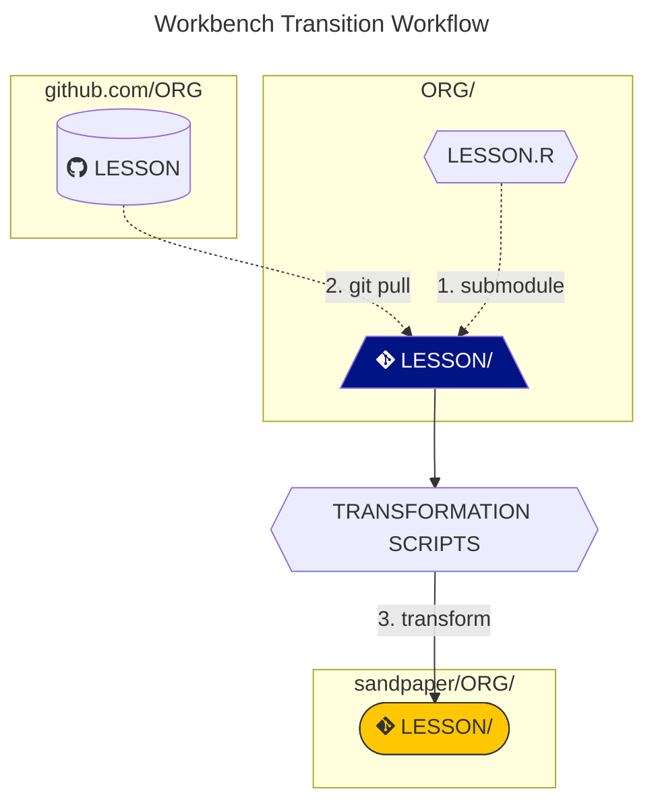
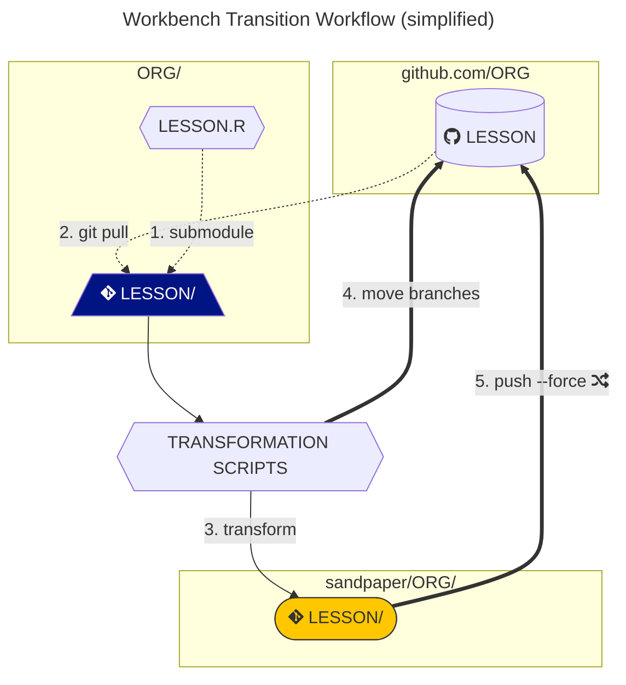
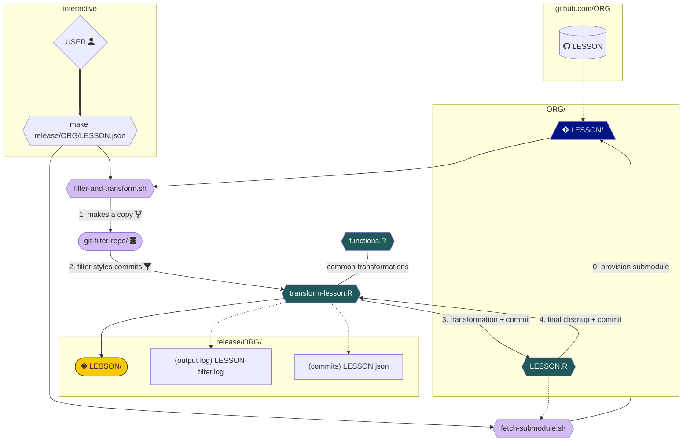
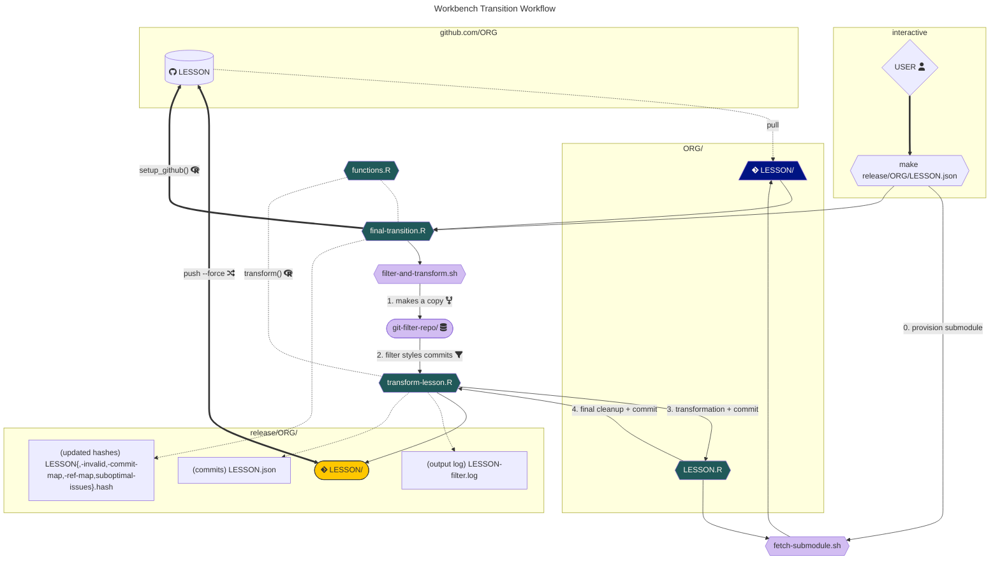
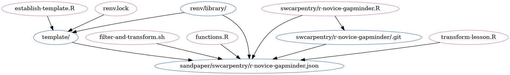

# Transitioning Carpentries Lessons

This repository contains a workflow for transitioning Carpentries lessons built
from [the all-in-one infrastructure](https://github.com/carpentries/styles) (aka 
"The Lesson Template") to [the decoupled/centralised 
infrastructure](https://carpentries.github.io/workbench) (aka "The Carpentries
Workbench"). The intent of this was explicitly to provide a workflow that could
transition all of the [61 official Carpentries lessons](https://feeds.carpentries.org/lessons.json).
It is not guaranteed to work for any lessons outside of The Carpentries.

If you want to use this workflow here are the steps:

1. install R, Python, and the gh utility (see [the usage section](#usage))
2. add a lesson R script using `bash add-lesson.sh <ORG>/<LESSON>`
3. run `make sandpaper/<ORG>/<LESSON>.json` to test and iterate on the
   transformation (see [the overview section](#overview) for details) 

This workflow will create a submodule for this that will be kept up-to-date
until you release the transitioned lesson. 

The release process uses tools built for R, python, Git, and BASH and is
described in [The Transition Workflow Documentation](transition-workflow) and 
[The Release Workflow Documentation](release-workflow.md). Tests of the release
workflow are outlined in [The Release Workflow Testing
Documentation](test-workflow.md)

> **Warning**
> This process is necessarily destructive and can only be perforemd one-way
> from [carpentries/styles](https://carpentries.github.io/lesson-example) to
> [The Carpentries Workbench](https://carpentries.github.io/workbench). Once a
> lesson is transitioned, it can not transition back. 

## How To Clone

This repository uses submodules which do not automatically get propogated when
you clone. The submodules are kept up-to-date via a GitHub action and the 
[`fetch-submodule.sh`](fetch-submodule.sh) script.


### To transform one lesson

If you wish to transform one lesson, you can clone this without pulling down the
submodules. This will save space and bandwidth and is generally the right choice.
There are two git commands you need to bootstrap the lesson. 

```sh
git clone https://github.com/carpentries/lesson-transition.git
cd lesson-transition
git submodule update --init git-filter-repo # make sure `git-filter-repo` is available
```

### To transform all lessons

If you have a good strong internet connection and you need to transform a lot of
repositories at once, then you may need to fetch all the submodules. You can do
so with the `--recurse-submodules` option.

```bash
git clone --recurse-submodules https://github.com/carpentries/lesson-transition.git
```

```bash
git pull --recurse-submodules
```

### Updating when submodules update

There will be times when the submodules update on GitHub and you forget to use
`--recurse-submodules`. When this happens, you will end up with mysterious
staged changes in your local clone. You can run `make modules` and the
submodules will recurse for you (note that this has the same effect as
`--recurse-submodules` and you may see an increase in the size of your
repository).

### Removing submodules

There are two ways to remove submodules from this repository:

1. transform a lesson to The Workbench. This will create a file called 
   `relase/ORG/REPO-invalid.hash`.
2. add the repository in the form of `ORG/REPO` to [`.module-ignore`](.module-ignore)

Either one of these will signal to `fetch-submodule.sh` that the submodule is no
longer used and it should be removed from this repository. 

If you do this by accident, you can use this pattern to restore the
module: 

```sh
git restore --staged .gitmodules ORG/REPO
git restore .gitmodules ORG/REPO
```

### Storage requirements

> **Warning** 
> 
> Cloning this repository with all the submodules will take a lot of bandwidth
> and space. As of this writing (commit [030f9cf](https://github.com/carpentries/lesson-transition/tree/030f9cf2bf46e0a44bffc0ca04bcc2d7cd78ce4f)),
> the weight of the repository is ~3 GB


During the transition, each of the lessons gains an entirely new set of
commits, which could double the size of the lesson repository (though, it will
almost always be less than that), but in terms of the `lesson-transition/`
directory on your machine: the size will triple if you clone this repository
AND transform all of the lessons. Below are tables that demonstrate the sizes
estimated of each of the lesson programs: 

table: Official Lessons (breakdown in [official-repo-sizes.csv](official-repo-sizes.csv))

|GitHub Organisation | Repo Size| Required (3x Repo Size)|
|:-------------------|---------:|-----------------------:|
|carpentries         |   63.55MB|                190.65MB|
|datacarpentry       |    1.42GB|                  4.27GB|
|librarycarpentry    |  284.96MB|                854.88MB|
|swcarpentry         |  334.73MB|                1004.2MB|
|TOTAL               |    2.09GB|                  6.28GB|


table: Community Lessons (breakdown in [community-repo-sizes.csv](community-repo-sizes.csv))


|GitHub Organisation   | Repo Size| Required (3x Repo Size)|
|:---------------------|---------:|-----------------------:|
|carpentries-incubator |    5.04GB|                 15.12GB|
|carpentries-lab       |  199.08MB|                597.24MB|
|TOTAL                 |    5.24GB|                 15.71GB|


## Overview

In general, there are two commands you would want to use:

| Purpose | command | effect |
| ------- | ------- | ------ |
| Test a lesson transition | `make sandpaper/<org>/<repo>` | creates a test transition of a lesson by making a copy of the submodule, and transforming it inside of the `sandpaper/` directory. This transformation adds some additional filters to the commit messages so that any issue or pull request references are masked. This prevents authors from getting notifications if you push it up to a testing repository. |
| Release a lesson transition (irreversible) | `make release/<org>/<repo>` | transitions a lesson and **reconfigure the source repository** to use The Workbench. **This is irreversible, so be sure that this is what you want to do **|

The test transition workflow is generally modelled like this:



When pushing to GitHub, the flow looks like this:



Expanded versions of these graphs can be found in the [Process section](#process)
of this README.

For details about the differences between styles and the workbench, you can
[look at the transition guide](https://carpentries.github.io/workbench/transition-guide.html).


## Motivation

There are over 100 lessons in The Carpentries, Carpentries Lab, and Carpentries
Incubator combined and they are all built in a _slightly_ different way. 

In addition to the difference between kramdown (Jekyll) syntax and Pandoc
(Workbench/R Markdown) syntax, the styles lessons contain a lot of commit
history that is unrelated to the lesson content itself. Some R-based lessons
contain commits of generated output like images that bloat the repository.

Transitioning the content to use Pandoc syntax and the Workbench folder
structure is a _good enough_ approach, but we are still left with the previous
commits that are not related to the lesson itself. These extra commits are a
burden on the repository as they take up extra megabytes of space in the git
database. 

Thus, we are going one step further and _removing all commits that are not
strictly lesson content_. By removing these commits, we distill the commit
history to those that are relevant so that it paints a clearer picture of the
lesson development timeline and reduces the cognitive load needed to understand
how the lesson was created.

![a diagram demonstrating how git-filter-repo removes styles-specific commits
(grey) from the lesson content commits (blue). The top git tree representing a
styles lesson shows a git history that starts with styles and then branches to
include lesson commits in parallel with styles commits with a merge commit. The
bottom git tree representing a workbench lesson has the styles commits removed
and the connections between commits are represented with orange lines. Two new
commits in orange are added to the end of the tree that represent our automated
commits.](fig/git-filter-repo.svg)

Note: Excluding irrelevant commits from the history has precedent within The
Carpentries! Prior to 2015, Software Carpentry lessons all lived in a [monorepo
called `bc`](https://github.com/swcarpentry/DEPRECATED-bc). In 2015, there was
a need to update the infrastructure, but it did not make sense to include the
entire history of the shell lesson in the git lesson (and vice versa), so the
new repositories were seeded from the initial commits for each relevant lesson.
Take for example, the [initial commit with pages in
swcarpentry/git-novice](https://github.com/swcarpentry/git-novice/commit/83ffd211a270e332d9e4baefe00ee37de84bd50e)
and the [initial commit with pages for git-novice in the bc
repo](https://github.com/swcarpentry/DEPRECATED-bc/commit/b90dfde1beb67c445743d1801cde27bcf13e1078). 
Both of these commits were made on the same time, but one has a parent commit
and the other one doesn't. 

## Background

Since 2016, Carpentries lessons were based on a custom template that used the
Jekyll static site generator because this was by far the easiest and most
reliable way to host a website using GitHub. Lessons built from the template
also contained styling components in HTML, CSS, and JavaScript; validation
scripts in Python, and workflow tooling in BASH, Make, and R. Because these
components lived inside the lesson itself, the only way to update them was to
make a pull request from the source repository, which would add commit history
that was unrelated to the lesson itself. This brought in a number of issues:

1. Lessons were often out of date in terms of styling and tooling because the 
   process of merging in a separate repository is off-label use of git
2. (idiomatic) The default branch had to be `gh-pages` to allow GitHub to deploy
   the content to a website
3. Lesson publications became arduous because authors to styles needed to be
   filtered out from the history in order to compile the author list for the
   lesson
4. Jekyll was not built in a way that could be easily distributed across
   multiple platforms to people who were not software developers
5. Lessons based in R Markdown contained committed artefacts, which vastly
   increased the size of the repository.

The workbench separates the tools and styling from the content, so a lesson can
be created and authored without the contributors worrying about keeping the
lesson or tools up-to-date.


## Process


The process works in the following steps:

1. (manual step) create file named `<program>/<lesson>.R` (e.g. `swcarpentry/r-novice-gapminder.R`)
1. provision template with [`Rscript establish-template.R template/`](establish-template.R)
1. add/fetch git submodule of the repository for reference with [`fetch-submodule.sh <program>/<lesson>`](fetch-submodule.sh)
1. run [`filter-and-transform.sh sandpaper/<program>/<lesson>.json <program>/<lesson>.R`](filter-and-transform.sh), which does the following    
   i. performs a fresh clone of the submodule into `sandpaper/program/lesson/`    
   ii. use [`git-filter-repo`](https://htmlpreview.github.io/?https://github.com/newren/git-filter-repo/blob/docs/html/git-filter-repo.html) to exclude commits associated with [carpentries/styles](https://github.com/carpentries/styles)    
   iii. apply transformations in [`transform-lesson.R`](transform-lesson.R) to modify kramdown syntax to pandoc syntax and move folders    
   iv. apply additional needed transformations in `program/lesson.R` to fix any components that were not covered in the previous step    
   v. creates commits and records them in `sandpaper/program/lesson.json`    

![a diagram demonstrating how git-filter-repo removes styles-specific commits
(grey) from the lesson content commits (blue). The top git tree representing a
styles lesson shows a git history that starts with styles and then branches to
include lesson commits in parallel with styles commits with a merge commit. The
bottom git tree representing a workbench lesson has the styles commits removed
and the connections between commits are represented with orange lines. Two new
commits in orange are added to the end of the tree that represent our automated
commits.](fig/git-filter-repo.svg)

**Note: Not all of the repositories represented here are official Carpentries Lessons. Only swcarpentry, datacarpentry, librarycarpentry, and carpentries lessons are official**

These scripts require a setup with R and access to the internet. It is currently
a work in progress and may evolve in the future.

This process is fully demonstrated in the workbench testing workflow:




During the release process, the final transition workflow adds a step where
the lesson repository is transformed using the GitHub API:



The repositories that have previously been transferred can be found in [repos.md](repos.md).

## Beta Phase

The Workbench beta phase steps are described in full at 
[The Workbench website](https://carpentries.github.io/workbench/beta-phase.html).
The process of moving lessons in each part of the beta phase are documented in
[The Beta Phase Workflow document](beta-phase-workflow.md).

In short, the first part of the beta phase involves converting a snapshot of
a lesson to use The Workbench and host it on a separate GitHub organisation.

The second part of the beta phase involves converting the lesson to use The
Workbench _in place_ and moving a snapshot of the old version to a branch called
"legacy"


Maintainers should take care to make sure they do not accidentally merge
hundreds or thousands of commits during the conversion.

### Keeping your clone up-to-date

Once a lesson has transitioned to use The Workbench, the default branch of the 
lesson will be altered. Here are the steps you should perform to make sure you
do not end up with a borked repository:

#### Easy mode: delete/rename your local copy and re-clone

This method is guaranteed to prevent merge conflicts and give you a clean slate. 

#### Advanced: branch name shuffle

If you want to keep your local copy, here is how you can modify your lesson to update without merge conflicts:

##### For Markdown Lessons

Markdown lessons will have the default branch set to be `gh-pages`. In the
Workbench, this branch serves rendered HTML, so we will need to change the
name of this branch to `legacy/gh-pages` using a similar process that GitHub
recommends after a default branch name change:

```sh
git checkout gh-pages              # make sure you are gh-pages
git branch -m gh-pages legacy/gh-pages               # rename the gh-pages branch to legacy
git fetch origin                                     # fetch changes from GitHub
git branch -u origin/legacy/gh-pages legacy/gh-pages # make sure your legacy branch tracks
git checkout main                  # switch to the brand-new main branch
git remote set-head origin -a      # set main branch to be your local default
```

Here's what it looks like with output:

```sh
git checkout gh-pages              # make sure you are gh-pages
# Already on 'gh-pages'
# Your branch is up to date with 'origin/gh-pages'
# git branch -m gh-pages legacy/gh-pages      # rename the gh-pages branch to legacy
git fetch origin                              # fetch changes from GitHub
# remote: Enumerating objects: 415, done.
# remote: Counting objects: 100% (415/415), done.
# remote: Compressing objects: 100% (193/193), done.
# remote: Total 415 (delta 197), reused 415 (delta 197), pack-reused 0
# Receiving objects: 100% (415/415), 69.97 KiB | 1.19 MiB/s, done.
# Resolving deltas: 100% (197/197), done.
# From https://github.com/zkamvar/transition-test-2
#  + d5702e0...3fb3008 gh-pages        -> origin/gh-pages  (forced update)
#  * [new branch]      legacy/gh-pages -> origin/legacy/gh-pages
#  * [new branch]      main            -> origin/main
#  * [new branch]      md-outputs      -> origin/md-outputs
git branch -u origin/legacy/gh-pages legacy/gh-pages # make sure your legacy branch tracks
# branch 'legacy/gh-pages' set up to track 'origin/legacy/gh-pages'.
git checkout main                  # switch to the brand-new main branch
# branch 'main' set up to track 'origin/main'.
# Switched to a new branch 'main'
git remote set-head origin -a      # set main branch to be your local default
# origin/HEAD set to main
```

##### For R Markdown Lessons

R Markdown lessons will have the default branch set to be `main`. The
rendered output of this branch lives in `gh-pages`. The new branches will
histories that will have different commits, so the process for updating is
similar to that of the Markdown lessons, with two extra steps to protect
your main branch.

```sh
git checkout main                  # make sure you are on main
git branch -m main legacy/main     # change 'main' to legacy
git checkout gh-pages              # switch to gh-pages
git branch -m gh-pages legacy/gh-pages       # rename the gh-pages branch to legacy
git fetch origin                             # fetch changes from GitHub
git branch -u origin/legacy/main legacy/main # make sure your legacy branches track
git branch -u origin/legacy/gh-pages legacy/gh-pages 
git checkout main                  # switch to the brand-new main branch
git remote set-head origin -a      # set main branch to be your local default
```

Here's what it looks like with output (NOTE: ZHIAN KNOWS THIS OUTPUT IS OUTDATED, BUT THE GIST IS STILL THE SAME)

```sh
git checkout main                  # make sure you are on main
# Already on 'main'
# Your branch is up to date with 'origin/main'
git branch -m main old             # change 'main' to a local 'old' branch
git checkout gh-pages              # switch to gh-pages
# branch 'gh-pages' set up to track 'origin/gh-pages'.
# Switched to a new branch 'gh-pages'
git branch -m gh-pages legacy      # rename the gh-pages branch to legacy
git fetch origin                   # fetch changes from GitHub
# remote: Enumerating objects: 5004, done.
# remote: Counting objects: 100% (5004/5004), done.
# remote: Compressing objects: 100% (2010/2010), done.
# remote: Total 5004 (delta 2970), reused 5000 (delta 2966), pack-reused 0
# Receiving objects: 100% (5004/5004), 39.98 MiB | 32.57 MiB/s, done.
# Resolving deltas: 100% (2970/2970), done.
# From https://github.com/[PROGRAM]/[LESSON]
#  + 78697dd...087da6e gh-pages   -> origin/gh-pages  (forced update)
#  + 8e955fe...f6eaf66 main       -> origin/main  (forced update)
#  * [new branch]      legacy     -> origin/legacy
#  * [new branch]      md-outputs -> origin/md-outputs
git branch -u origin/legacy legacy # make sure your legacy branch tracks
# branch 'legacy' set up to track 'origin/legacy'
git checkout main                  # switch to the brand-new main branch
# branch 'main' set up to track 'origin/main'.
# branch 'main' set up to track 'origin/main'.
# Switched to a new branch 'main'
git remote set-head origin -a      # set main branch to be your local default
# origin/HEAD set to main
```

## Usage

### Requirements

This tool requires Git, R, Python, BASH, and Make to convert the lessons. There
is one make command that uses the `gh` github command line interface. This will
also provision pandoc for you if you do not have one on your computer. 

The tool used to filter commits is a python tool called
[git-filter-repo](git-filter-repo) and we have a copy as a submodule of this
project. 

The R packages required are provided in the [`renv.lock` file](renv.lock).

### Adding a new lesson

To add a lesson for translation, there are two steps:

1. add an R script with the repository name under a folder with the organisation
   name (e.g. `swcarpentry/r-novice-gapminder.R` or 
  `datacarpentry/R-ecology-lesson.R`). 
2. run `make`

### Bootstrapping infrastructure

> **Note** 
>
> **If you have never used {renv} before**, then you will need to _manually
> confirm that you want to use {renv}_ in an interactive R session. To do this,
> open R after you have cloned this repository and {renv} will bootstrap itself
> and then print a message on your screen informing you that it wants to create
> a global package cache and where it exists.

The infrastructure will bootstrap itself (so long as you have the [Requirements](#requirements)
installed) when you run a conversion command. This will include:

 0. The lesson submodule
 1. R package cache
 2. The Workbench template
 3. pandoc version 2.19.2 (the one used in RStudio by default)

To bootstrap the infrastructure without converting lessons, you can run the
following targets:

```bash
make template modules
```

This will bootstrap the packages used for the scripts, create the sandpaper 
template, and update the git submodules

### Updating R packages

To update the R packages used for translation, you can run `make update`

### Individual targets

To make an individual target, run 

```bash
make sandpaper/datacarpentry/R-ecology-lesson.json
```

### Parallel processing

To run everything from scratch with 7 threads

```bash
rm -rf sandpaper/
make -j7
```

For the curious, this is the path of the makefile for a single target:




### Sending lessons to GitHub

Because my changes will be stacked on top of the last commit of the previous
lesson, every time a new commit is added or I change something in the build
process, I will need to burn it all down and rebuild these lessons so that I do
not end up with weird merge conflicts or a force-pushed history, thus I need to
be able to do the following from the command line:

1. create repositories 
2. assign the repositories to bot teams.
3. destroy repositories that are outdated in the past.

I have created a [sandbox organisation](https://github.com/fishtree-attempt)
where I know I can break things if I need to set up or tear down things. I have
given the [Carpentries Apprentice](https://github.com/carpentries-bot) admin
access so that I do not risk my own token being used to create and delete
repositories.

To send lessons to GitHub, you need to make sure you have the correct tokens
set up from GitHub in addition to your GitHub PAT, which will give you repo
access:

 - [NEW\_TOKEN](https://github.com/settings/tokens/new?scopes=repo,workflow&description=GITHUB_NEW) to create and push the new repository
 - [BOT\_TOKEN](https://github.com/settings/tokens/new?scopes=admin:org&description=GITHUB_BOT) to assign the bots team to the repository
 - [DEL\_TOKEN](https://github.com/settings/tokens/new?scopes=delete_repo&description=GITHUB_DEL) to delete a repository.

In testing, **I set these tokens to expire the next day**.

Because I do not want to keep these hanging around my BASH environment, and 
because I want to be difficult, I am using a [vault secrets engine called
tr](https://learn.hashicorp.com/tutorials/vault/getting-started-secrets-engines?in=vault/getting-started) by running `vault server -dev` in a separate window and then:

```bash
 vault secrets enable -path=tr kv
 vault kv put -mount=tr auth \
bot=<token> \
del=<token> \
new=<token>
```

From there, I can use [`./pat.sh bot`](pat.sh) to extract the bot token so that
it can be used with the [`create-test-repo.sh`](create-test-repo.sh) script:

```bash
BOT_TOKEN=$(./pat.sh bot) NEW_TOKEN=$(./pat.sh new) \
create-test-repo.sh carpentries-incubator/citable-software bots fishtree-attempt
```

There is also the `github` target which will first delete any repositories you
have created with this script and then re-create and upload them:

```bash
BOT_TOKEN=$(./pat.sh bot) DEL_TOKEN=$(./pat.sh del) \
make github
```

### Notes

The `transform-lesson.R` script is meant to serve as a generalized method for
converting lesson content from one engine to the other. It does the majority of
the heavy lifting, but it can not completely convert lessons perfectly. Because
each lesson is built in a _slightly_ different way and kramdown (Jekyll's 
markdown parser) allows for patterns that would be invalid in any other parser,
the conversion is not 100%. This additional R script allows you to make
additional changes such as moving files or fixing errors. This file can be blank
if there are no changes you wish to make

If your lesson is in a repository that does not belong to an official carpentries
account, you will need to append the `DIRS` varaible in the makefile.

## Requirements

This repository has package management via {renv}, so there are two steps to
getting set up:

1. install R
2. Open R in this repository. {renv} should prompt you about using a central cache.
   Select yes.
2. Run `make restore`.
 
This will restore the renv session to the correct state so that you can convert
the lessons contained with `make`

The packages used in this script are the same packages that are used in 
{sandpaper}, you can [follow the setup instructions to get this script working
](https://carpentries.github.io/sandpaper-docs/#setup).

## Post translation

After a lesson is translated it lives in a brand new repository that will have
three commits:

1. the bootstrap of the new lesson
2. the first pass of `transform-lesson.R`
3. Any other changes dictated by your custom script. 

To get this to GitHub, I like to use the {usethis} package. For this operation,
you _will need_ to set up your GitHub PAT. [I wrote up a tutorial to set up your
PAT via R that may be helpful](https://carpentries.github.io/sandpaper-docs/github-pat.html).

If, however, you are on Linux and find yourself in credentials hell, you might
find solace in [Danielle Navarro's blog post from August on setting up credentials for Ubuntu](https://blog.djnavarro.net/posts/2021-08-08_git-credential-helpers/)


### Steps for uploading the lesson and activating github pages

Here, I'm using the [fishtree-attempt](https://github.com/fishtree-attempt), which
is a pun on Carpentries (fish: carp, tree: ent, attempt: tries), but more 
importantly, it is a sandbox organisation in which I can comfrotably destroy and
re-create lessons at will so that I can test out the translation features.

You should use your own account for this as you will likely not have access to
the data-lessons organisation.

```r
# In the directory of the new lesson
library(usethis)
use_github(organization = "my-organisation")
```

After a few minutes, the lesson will be sent to GitHub and build the site, but
the pages need to be activated, which you can do via usethis:

```r
# In the directory of the new lesson
library(usethis)
use_github_pages()
```

