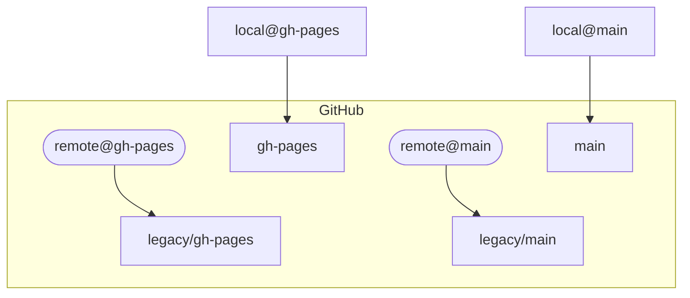

## Transition Release Workflow

After you have [met the software and access requirements](#requirements),
the transition release workflow consists of the following steps:

0. [updating styles and creating an archive](#pre-transition)
1. [alerting the maintainers of the impending release and restricting access](#alerting-maintainers-and-restricting-access)
2. [creating the release](#creating-the-release) (see the [details of the release process](#release-details))
3. [add invalid hash to file.carpentries.org](#add-invalid-hash)
4. [committing artifacts and tagging the release](#commit-and-create-tag)
5. [reinstate permissions](#reinstating-permissions)

### Pre-transition

Before you enter this workflow, for Carpentries Lessons, it's important to do
the following steps:

1. update the repository with [carpentries/styles] using the [update styles
   script](https://github.com/carpentries/actions/blob/main/update-styles/update-styles.sh)
   and create a pull request
   ```sh
   REPO=[repo]
   git clone ${REPO} ${REPO} && cd ${REPO}
   git switch -c update-styles-2023-04
   curl -sSL https://raw.githubusercontent.com/carpentries/actions/main/update-styles/update-styles.sh | bash /dev/stdin
   git commit -m 'update styles 2023-04'
   git push --set-upstream origin update-styles-2023-04
   ```
2. After styles is merged, Create a lesson release using the [{chisel}
   package](https://github.com/carpentries/chisel) (NOTE: this is only for Core
   Team use). Create a Pull Request
3. Use the [{gitcellar} package](https://docs.ropensci.org/gitcellar/) to
   create an archive of the repository and store it in an archive like AWS Glacier
   (note: this will take some time)
   ```r
   library("gitcellar")
   library("future")
   plan(multisession)
   get_repo <- function(slug) {
     repo <- strsplit(slug, "/")[[1]]
     future({
       download_organization_repos(repo[[1]], keep = repo[[2]])
     })
   }
   today <- lapply(c("carpentries/instructor-training", "swcarpentry/python-novice-inflammation"),
     get_repo)
   ```
4. as an extra precaution, clone a bare mirror of the repository using `git clone --mirror ${REPO}`

Once these steps are done, we can then proceed with the transition.


### Requirements

To get this running, you need the requirements for this repo:

 - git
 - python version >= 3
 - R version >= 4.1
 - (optional) valut >= v1.12.2

#### GitHub PAT

The release workflow REQUIRES a GitHub personal access token to be avaialble via
the environment variable `RELEASE_PAT`. This token can have one of two forms

##### Fine-Grained PAT (preferred)

As of 2023-04-07, I have updated the workflow to work with fine-grained
Personal Access Tokens. The benefit of these is that we can restrict the
tokens to specific repositories so that when we are doing the transition, we do
not run into a situation where repositories we already transitioned (or have
yet to transition) are not accidentally clobbered.

To create a new token, head over to <https://github.com/settings/personal-access-tokens/new> and then set the resources this way:

| parameter | value | notes |
| --------- | ----- | ----- |
| Resource owner | The GitHub organisation | if you use your personal account, you may not have access |
| Repository access | Only select repositories | leave this blank until we are ready to work with it |
| Repository permissions | Read and Write on **actions, administration, contents, pages, pull requests, workflows** |  |
| Organization permissions | none |  |


The good thing about these tokens is that their permissions can be modified on
the fly and they can be regenerated with one click. This means that it will be
possible to create one token, store it in your environment, and then update it
as you work through the release process.

##### Token (classic)

I have created [a tutorial if you do not have one](https://carpentries.github.io/sandpaper-docs/github-pat.html#creating-a-new-github-personal-access-token).

Your token should have the following scopes: `repo,user,workflow`.

You must also have _admin access_ to whatever organisation you wish to deploy to.

### Release Details


The release workflow differs from the [transition workflow](transition-workflow.md)
slightly in a few ways: 

1. the commit messages are _not_ masked in the release workflow. It was
   necessary to mask references to users and issues in the commit messages for
   the transition workflow to ensure that users were not accidentally notified
   during testing.
2. the `workbenh-beta.yaml` workflow to deploy the lesson to AWS is removed.
3. the outputs of `git-filter-repo` are written to `*.hash` files in the
   same folder as the released repository `release/[ORG]/`

The transition steps are completed in the majority of 
[final-transition.R](final-transition.R). Once they complete successfully you 
have a fully-transitioned lesson that is ready to be pushed to GitHub. If the
workflow errors after this point, then you can manually send it to GitHub. 


At this point, the transition script will check the `RELEASE_PAT` environmental
variable for a github token that will enable you to update your repository and
then call the `setup_github()` function from [functions.R](functions.R), which
will do the following steps:


1. modify the config.yaml file to include the date the repository was created
2. rename existing GitHub branches (see diagram)
3. force push `main` and enable github workflows to run
4. force push an orphan `gh-pages` with the [close-pr.yaml] workflow that will prevent
   any pull requests acidentally being opened
5. protect the `main` branch

The branch renaming can be confusing, but this is what it looks like for
lessons that use R Markdown (which have both a main and gh-pages branch):



One of the challenges here is that GitHub's API is ever changing, so what worked
yesterday may not work today. If you run into errors in any of the above steps,
the first thing to do is to keep calm and remember that none of the steps here
is necessarily destructive because we are renaming the previous branches. This
is the full workflow for sending the repository to GitHub if you do not have
access to the API:

0. (in local) move to your lesson with `cd release/[org]/[repo]` (replace `[org]/[repo]`) with the name of your lesson.
1. (in local) ensure that `created:` is set to the correct date in `config.yaml`
2. (on GITHUB) rename `gh-pages` to `legacy/gh-pages` (if `main` is your default, then also rename that to `legacy/main`)
3. (on GITHUB) enable github actions to run
4. (in local) run `git fetch --prune origin`
5. (in local) ensure your remote origin is the correct URL
6. (in local) create an orphan `gh-pages` branch that contains a workflow that will close all PRs 
   to that branch and force-push it up (run below script from the transitioned repo):
   ```
   # checkout and clean gh-pages orphan branch --------------
   git checkout --orphan gh-pages
   git rm -rf .
   # create github workflow for rejecting pull requests -----
   mkdir -p .github/workflows/
   curl -o .github/workflows/close-pr.yaml https://raw.githubusercontent.com/carpentries/lesson-transition/main/close-pr.yaml
   git add .github/workflows/close-pr.yaml
   # commit and push ----------------------------------------
   git commit --allow-empty -m "Initializing gh-pages branch"
   git push --force origin HEAD:gh-pages
   # switch back to main ------------------------------------
   git switch main
   ```
7. (in local) run `git switch main && git push --force --set-upstream origin main`
8. (on GITHUB) set the main branch to be the default 
9. (on GITHUB) (optional) add branch protection to the main branch (to prevent people from accidentally force-pushing)
10. (on GITHUB) lock all branches that start with `legacy/`

Once that happens, you can move on to [the manual next steps on GitHub](#on-github).


### Alerting the maintainers and restricting access

The `create-collab-notice.R` script takes a repository name as its argument and
gives you markdown text for you to paste into a comment: 

```bash
$ Rscript create-collab-notice.R carpentries/maintainer-onboarding
ℹ Gathering collaborators for carpentries/maintainer-onboarding with at least push access

── displaying to screen ───────────────────────────────────────────────────────────────
This lesson will be converted to use [The Carpentries Workbench][workbench]
To prevent accidental reversion of the changes, we are temporarily revoking
write access for all collaborators on this lesson:

 - [ ] @chendaniely (push)
 - [ ] @katrinleinweber (push)
 - [ ] @vinisalazar (push)

If you no longer wish to have write access to this repository, you do not
need to do anything further.

1. What you can expect from the transition 📹: https://carpentries.github.io/workbench/beta-phase.html#beta
2. How to update your local clone 💻: https://carpentries.github.io/workbench/beta-phase.html#updating-clone
3. How to update (delete) your fork (if you have one) 📹: https://carpentries.github.io/workbench/faq.html#update-fork-from-styles

If you wish to regain write access, please re-clone the repository on your machine and
then comment here with `I am ready for write access :rocket:` and the
admin maintainer of this repository will restore your permissions.

If you have any questions, please reply here and tag @zkamvar

[workbench]: https://carpentries.github.io/workbench

── MANUAL STEP ────────────────────────────────────────────────────────────────────────
ℹ Visit <https://github.com/carpentries/maintainer-onboarding/settings/access> and set everyone's access to `read`

── DONE ───────────────────────────────────────────────────────────────────────────────
```

You also have a link to the access settings where you can set everyone's access
to "read". Note that you should leave one maintainer as admin to grant the others
access ([example comment to admin](https://github.com/carpentries-incubator/bioc-project/issues/48#issuecomment-1435372672)).


### Adding Tokens to your environment

One important thing: if you do not want your tokens exposed in your bash
history, then add a blank space before your commands. This makes fixing mistakes
annoying, but means that you don't have a bunch of tokens floating in your 
history to exploit. 

#### If you have [installed vault](https://developer.hashicorp.com/vault/tutorials/getting-started/getting-started-install)

I like to use vault to store my tokens because it's an extra layer that allows
me to store them without having to export them as variables. I'm pretty sure 
there is a better way, but I don't know about it.

I've modified [instructions from their tutorial](https://learn.hashicorp.com/tutorials/vault/getting-started-secrets-engines?in=vault/getting-started)

Start by opening two new bash shells.

In one shell, start by running `vault server -dev`. This will display something
like 

```
WARNING! dev mode is enabled! In this mode, Vault runs entirely in-memory
and starts unsealed with a single unseal key. The root token is already
authenticated to the CLI, so you can immediately begin using Vault.

You may need to set the following environment variables:

    $ export VAULT_ADDR='http://127.0.0.1:8200'
```

Leave that shell open because that is what's running your vault server. Copy
and paste the export statement into your original window and the second window.

Now it is time to place your secrets into the key-value (kv) store. Each store
is labelled by a path, which can store multiple key-value pairs:

```bash
# note the space at the beginning
 vault secrets enable -version=2 -path=tr kv 
```

Now it's time to place your token(s)  in the store. I like to create the tokens
on their own lines, so note the slash at the end. 

```bash
# note the space at the beginning
 vault kv put -mount=tr auth \
release=<PASTE TOKEN HERE> \
pat=<PASTE_TOKEN_HERE>
```

From there, I can use [`./pat.sh release`](pat.sh) to extract the release token
to pass into a new variable.

##### Updating the token

As you go through the release process, you will want to update the token based
on the lesson program you are using. To do that you can use the `patch` method:

```bash
# note the space at the beginning
 vault kv patch -mount=tr auth \
release=<PASTE TOKEN HERE>
```


#### If you do not have vault installed

If you do not have vault installed, you can still store your tokens as local
variables,

```bash
# note the space at the beginning
 RELEASE_PAT=<PASTE_TOKEN_HERE>
 GITHUB_PAT=<PASTE_TOKEN_HERE>
```

### Creating the Release

To create the release, you will use the following command (note the spaces at
the beginning of the command to hide it from the shell history).

```bash
# if you are using vault
 RELEASE_PAT=$(./pat.sh release) make release/[org]/[repo].json
# otherwise
 RELEASE_PAT=github_XXX make release/[org]/[repo].json
```

where `[org]` is the organisattion and `[repo]` is the lesson name. For example,
this created the release for the bioc intro lesson for carpentries incubator:

```
 RELEASE_PAT=$(./pat.sh release) make release/carpentries-incubator/bioc-intro.json
```

The release process will take a few minutes depending on the speed of your
processor and the speed of your connection. When it is finished, you will have
[a set of files with a `*.hash`
extension](https://github.com/carpentries/lesson-transition/commit/747030b61359a61bd01e299ab2d7ff5714af69d9).
These are the outputs from the commit process.

If everything worked well without errors, see the [manual next steps on
GitHub](#on-github), otherwise, read below.

#### Recovering from failure

Because this involves networking, there are different modes of failure that can
lead to a borked transfer. I will be adding situations as they come up

##### Invalid token

if you see an error that looks something like this, then it's likely that your
PAT (hopefully a fine-grained PAT) does not have the right permissions.

```r
ℹ renaming default branch (gh-pages) to legacy/gh-pages
POST /repos/fishtree-attempt/znk-transition-test/branches/gh-pages/rename
Error in `gh::gh()`:
! GitHub API error (403): Resource not accessible by personal access token
ℹ Read more at <https://docs.github.com/rest/branches/branches#rename-a-branch>
Backtrace:
    ▆
 1. └─global setup_github(...)
 2.   └─gh::gh(RENAME, new_name = glue::glue("legacy/{default}"), .token = .token)
 3.     └─gh:::gh_make_request(req)
 4.       └─gh:::gh_error(resp, error_call = error_call)
 5.         └─cli::cli_abort(...)
 6.           └─rlang::abort(...)
Execution halted
```

The solution is to set the correct permissions for your token (listed above).

> **Note**
> 2023-08-23
> GitHub API is now throwing permissions errors for the branch rename endpoint.
> See [issue #93](https://github.com/carpentries/lesson-transition/issues/93) for
> more details.

<details>
<summary>Full error message</summary>

```r
→ preparing to run `setup_github(path = 'release/fishtree-attempt/znk-transition-test', owner = 'fishtree-attempt', repo = 'znk-transition-test')` in
→ 5...
→ 4...
→ 3...
→ 2...
→ 1...

── Credentials ───────────────────────────────────────────────────────────────────────────────────────────────────────────────────────────────────────────────────────────────
{
  "name": "Zhian N. Kamvar",
  "login": "zkamvar",
  "html_url": "https://github.com/zkamvar",
  "token": "gith...xNYl"
} 

── Setting up repository ─────────────────────────────────────────────────────────────────────────────────────────────────────────────────────────────────────────────────────
ℹ Writing to /home/zhian/Documents/Carpentries/Git/carpentries/lesson-transition/release/fishtree-attempt/znk-transition-test/config.yaml
→ created:  -> created: '2023-05-02'
Running git add config.yaml
Running git commit --amend --no-edit
[main dba8b15] [automation] final workbench updates
 Date: Tue May 2 07:52:10 2023 -0700
 2 files changed, 3 insertions(+), 64 deletions(-)
 delete mode 100644 .github/workflows/workbench-beta-phase.yml
ℹ renaming default branch (gh-pages) to legacy/gh-pages
POST /repos/fishtree-attempt/znk-transition-test/branches/gh-pages/rename
Error in `gh::gh()`:
! GitHub API error (403): Resource not accessible by personal access token
ℹ Read more at <https://docs.github.com/rest/branches/branches#rename-a-branch>
Backtrace:
    ▆
 1. └─global setup_github(...)
 2.   └─gh::gh(RENAME, new_name = glue::glue("legacy/{default}"), .token = .token)
 3.     └─gh:::gh_make_request(req)
 4.       └─gh:::gh_error(resp, error_call = error_call)
 5.         └─cli::cli_abort(...)
 6.           └─rlang::abort(...)
Execution halted
make: *** [Makefile:106: release/fishtree-attempt/znk-transition-test.json] Error 1
```

</details>


### On GitHub

When the transition is finished, you must comment on the original issue. Here
is a template:

```markdown
The deed is done. The infrastructure takes a few minutes to bootstrap and cache the packages for the lesson build. Once the build is done, I will switch github pages to deploy from the `gh-pages` branch and you will have your workbench lesson. 

Thank you all for your enthusiasm and your patience!
```

The last step is to ensure that GitHub pages deploys The Workbench version of
the site. During the transition, the original `gh-pages` branch was renamed to
`legacy/gh-pages` and GitHub knew that it needed to deploy from that branch.
This allows us to do the transition on the source without disrupting the web
traffic. 

To switch the site to use The Workbench, wait for the "01 Build and Deploy"
GitHub workflow to finish running (you can find it under the "Actions" tab on
GitHub) and then head to Settings > pages and then set the branch that deploys
GitHub pages to `gh-pages` from the root. Once you do that your transitioned
lesson will deploy in about 30 seconds.

### Add invalid hash

The transition process will remove and/or overwrite commits. This allows us to
detect if someone is attempting to create a pull request from an old fork.

For each lesson, a file called `release/{org}/{lesson}-invalid.hash` is created.
This contains a single hash representing a has that was present in the
repository just before the transition that was no longer present. These hashes
are stored in JSON format in <https://files.carpentries.org/invalid-hashes.json>.

To add to this, update the file in <https://github.com/carpentries/reactables>. 

#### lessons built with carpentries/styles

Lessons that were originally built with carpentries/styles will all have a
common ancestor commit that can be safely ignored: 
[e83e2c9bd](https://github.com/carpentries/styles/commit/e83e2c9bdeb259fcb7b12ae21da8f6eac8ff34a4)

However, the commit that appears in `release/{org}/{lesson}-invalid.hash` may not
be that one. 

#### lesson built with remote theme

For lessons that were built with the remote theme, such as
<https://carpentries-incubator.github.io/managing-computational-projects>, they
will all have different invalid hashes and there will be fewer empty hashes (in
the case of this lesson, there is only [one empty
hash](https://github.com/carpentries/lesson-transition/blob/e5fc4ff9e810e6bda9ebc2730d55f9639fc9177d/release/carpentries-incubator/managing-computational-projects-commit-map.hash#L255).
One thing to watch out for, however, are lessons that started with remote theme
and accidentally merged with styles at some point in time. If
`release/{org}/{lesson}-invalid.hash` contains
[e83e2c9bd](https://github.com/carpentries/styles/commit/e83e2c9bdeb259fcb7b12ae21da8f6eac8ff34a4),
then there is a chance that this commit may not capture all the potential
forks. To solve this issue, find the first commit of the repository and
reference the commit map to find the invalid commit.

### Commit and create tag

You should commit these release hash files:

```sh
git add release/
git commit -m 'release [org]/[lesson]'
```

Once you do that, you can tag it. If you use gpg on your machine, I would highly
recommend that you _sign_ your tag:

```sh
git tag -s release_[abbrev]/[lesson] -m '[your message here]'
```

Here are the naming conventions for `[abbrev]`:

| tag | organisation     |
| --- | ---------------- |
| cp  | carpentries      |
| dc  | datacarpentry    |
| swc | swcarpentry      |
| lc  | librarycarpentry |
| lab | carpentries-lab  |
| incubator | carpentries-incubator |


Once you do that, then you can push the commit and tag up with:

```sh
git push
git push --tags
```

If you have a set of releases that you want to do, I would recommend to not push
until you are finished. This way, when the submodules update on the remote, you 
don't have to worry about conflicts due to the changed histories of the lessons
that you just converted.

### After pushing commits and tags

After the commits and tags are pushed, comment on the issue with the link to the
live lesson AND the link to the commit map.

You can use the `create-success-comment` to create this comment

```sh
Rscript create-success-comment.R [abbrev]/[lesson]
```

For example, this is how to do it for the the lc-git release:

```sh
Rscript create-success-comment.R lc/lc-git
```

```markdown
The Workbench version is now live: https://{org}.github.io/{repo}/

In addition, here is [map of commits that were changed during the transition](https://github.com/carpentries/lesson-transition/blob/release_{tag}/release/{org}/{repo}-commit-map.hash)
```

The `{tag}` will be the `[abbrev]/[lesson]` part of the signed tag you created earlier.

## Reinstating Permissions

During the transition, access to everyone but the Core Team Curriculum and 
Infrastructure is restricted to read-only. This prevents people from
accidentally force-pushing the lesson. The [message created by
`create-collab-notice.R`](create-collab-notice.R) lists _anyone_ who has write
access. Below is a table with the teams and what access they should have after
the transition and after confirmation:

| Team | slug pattern | access post-transition | access post-confirmation |
| ---- | ------------ | ---------------------- | ------------------------ |
| Maintainers | `@{organization}/{lesson}-maintainers` | Triage | Maintain |
| Curriculum Advisors | `@{organization}/curriculum-advisors{?-{curricula}}` | Triage | Triage |
| Core Team Curriculum | `@{organization}/core-team-curriculum` | Admin | Admin |
| Core Team Infrastructure | `varies` | Admin | Admin |
| Outside Collaborators    | NA       | Read  | determine based on maintainer list | 

Before the transition, Zhian created new _temporary_ teams for all repositories
called `@{organization}/{lesson}-maintainers-workbench`. This team makes it
possible for us to give access to the maintainers who have requested it, while
still giving time for the other maintainers to complete the tasks. The team
should be removed once all maintainers have requested access.


When a maintainer responds to the issue with `I am ready for write access
:rocket:`, then you should head to
`https://github.com/{organization}/{lesson}/settings/access` and do the
following:

### If all the maintainers have requested access

This means that all maintainers are onboarded and do not have risk of borking
the lesson with an accidentaly force-push. 

Switch the `-maintainers` team to have the "Maintain" role and remove the
`-maintainers-workbench` team, as that team no longer serves a purpose.

Comment on the issue that all maintainers now have access and close the issue. 

### If not all the maintainers have requested access yet

This means that some maintainers are still at risk for borking the repository
from an old local clone.

1. Check that they are actually a maintainer
2. Click on the `-maintainers-workbench` team and then click "Add a member" to
   add the member to the team via their github user name.
3. Tag the member in the issue comment and let them know their access has been
   granted. 

Note: for some LibraryCarpentry repositories, maintainers were not properly
added to the team and they may remain as outside collaborators. In this case,
you should notify them that they need to check their email and follow the
instructions from there to regain access.

### If a curriculum advisor requests access

If a curriculum advisor requests access, let them know that they should not have
access

(from [Toby's comment on organization-genomics](https://github.com/datacarpentry/organization-genomics/issues/152#issuecomment-1532649463)):

```markdown
Hey @{NAME} thanks for following up. To shore up the security of the lesson repositories, the Curriculum Team would like to use this opportunity to tidy up the access levels we are providing to community members across the various repos. According to our records, you're not a Maintainer on this lesson, but I think you had previously been granted write access to the repository in your capacity as a {CURRICULUM} Curriculum Advisor. 

For now, we are going to provide write access only to Maintainers - though that decision will be open to review, so please let us know (@ me or {ORGANIZATION}/core-team-curriculum) if this interferes with the CAC's ability to perform their duties.
```
